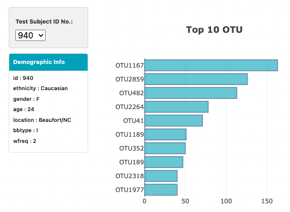
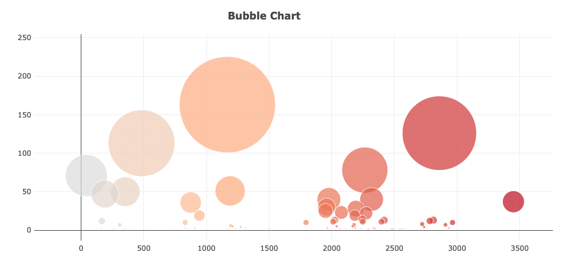
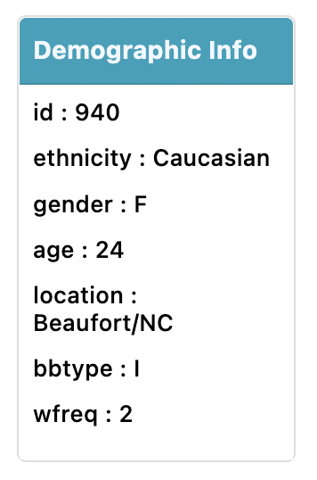

# Belly_Button_Biodiversity

## Target
Build an interactive dashboard to explore the [Belly Button Biodiversity dataset](http://robdunnlab.com/projects/belly-button-biodiversity/), which catalogs the microbes that colonize human navels.<br/>

The dataset reveals that a small handful of microbial species (also called operational taxonomic units, or OTUs, in the study) were present in more than 70% of people, while the rest were relatively rare.<br/>

[**Click Here**](https://simon2383.github.io/belly-button-challenge/) to find out how the web page looks like. <br/>

 <br/>

## Step by Step Approch

### Step 1 Use the D3 library to read in `samples.json` from the URL
* URL: `https://2u-data-curriculum-team.s3.amazonaws.com/dataviz-classroom/v1.1/14-Interactive-Web-Visualizations/02-Homework/samples.json`.<br/>

  ``` python 
  d3.json("https://2u-data-curriculum-team.s3.amazonaws.com/dataviz-classroom/v1.1/14-Interactive-Web-Visualizations/02-Homework/samples.json").then(function (data) {
      console.log(data);
  ```

### Step 2 Create a horizontal bar chart with a dropdown menu
  * Display the top 10 OTUs found in that individual.<br/>
  
  * Use `sample_values` as the values for the bar chart.<br/>

  * Use `otu_ids` as the labels for the bar chart.<br/>

  * Use `otu_labels` as the hovertext for the chart.<br/>

    

### Step 3 Create a bubble chart that displays each sample

  * Use `otu_ids` for the x values.<br/>

  * Use `sample_values` for the y values.<br/>

  * Use `sample_values` for the marker size.<br/>

  * Use `otu_ids` for the marker colors.<br/>

  * Use `otu_labels` for the text values.<br/>

  

### Step 4 Display the individual's demographic information
Display each key-value pair from the metadata JSON object somewhere on the page.<br/>
   

## Files
- [Output](https://github.com/Ash-Tao/Belly_Button_Biodiversity/tree/main/OutPut)<br/>
  - BubbleChart.png<br/>
  - DemographicInfo.png<br/>
  - Full Screen.png<br/>
  - GaugeChart .png<br/>
  - Info&BarChart.png<br/>

- [app.js](https://github.com/Ash-Tao/Belly_Button_Biodiversity/blob/main/app.js)<br/>

- [index.html](https://github.com/Ash-Tao/Belly_Button_Biodiversity/blob/main/index.html)<br/>

- [Data Sample](https://github.com/Ash-Tao/Belly_Button_Biodiversity/blob/main/samples.json)<br/>
